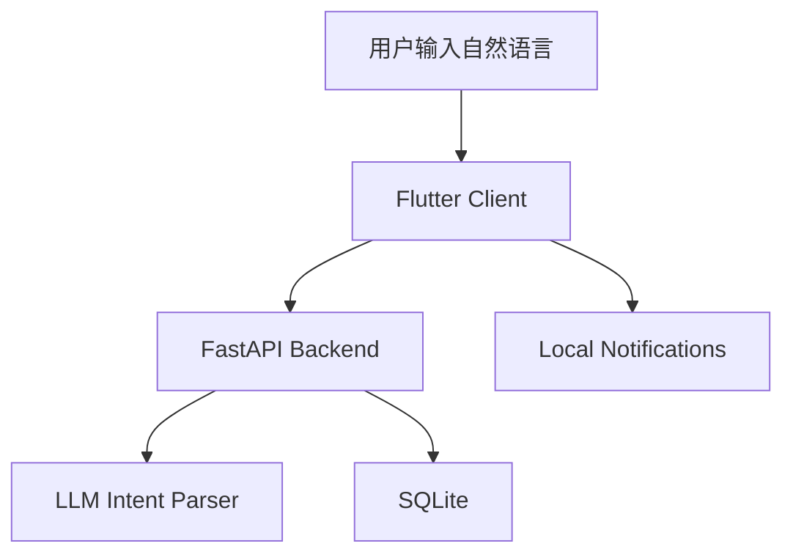

# SyncFlow AI

> 基于自然语言意图解析的个人时间与任务调度中枢

SyncFlow AI 是一个围绕“用一句话完成日程录入”打造的智能调度项目。当前仓库已经包含 Flutter 客户端与 FastAPI 后端，可完成自然语言解析、事件落库、日程查询与本地提醒等核心能力。

## 当前状态

- 当前版本：`v1.0.0`
- 仓库内容：Flutter 客户端 + FastAPI 后端
- 日程存储：SQLite
- 大模型接入：Volcengine Ark / Doubao 兼容配置
- 当前定位：可运行的 MVP 与后续功能演进基础

## 核心能力

- 自然语言转结构化日程：将一句话输入解析为标题、时间、时长等信息
- 事件增删改查：支持新增、更新、删除与时间范围查询
- 本地优先体验：客户端负责交互、设置与提醒，后端负责解析与数据接口
- API 可配置：支持通过配置接入不同模型参数
- 本地提醒闭环：Flutter 端已集成本地通知能力

## 项目结构

```text
.
├─ syncflow_backend/    FastAPI 后端、意图解析、SQLite 持久化
├─ syncflow_flutter/    Flutter 客户端、首页视图、设置页、本地提醒
├─ docs/                项目说明与分析文档（本地保留，不上传 GitHub）
├─ syncflow.svg         项目标识
└─ test_syncflow.py     本地测试脚本
```

## 系统架构



## 快速启动

### 1. 启动后端

```bash
cd syncflow_backend
pip install -r requirements.txt
uvicorn main:app --reload
```

可选环境变量示例见：
[`syncflow_backend/.env.example`](./syncflow_backend/.env.example)

### 2. 启动 Flutter 客户端

```bash
cd syncflow_flutter
flutter pub get
flutter run
```

## 主要接口

- `POST /api/v1/intent/parse`：解析用户输入并执行事件变更
- `GET /api/v1/events`：按 `today`、`week` 或自定义时间范围查询事件
- `PATCH /api/v1/events/{event_id}`：更新事件
- `DELETE /api/v1/events/{event_id}`：删除事件
- `GET /api/v1/runtime/status`：查看当前运行状态

## 文档说明

- 详细项目说明见 [`docs/README.md`](./docs/README.md)
- 效能分析文档见 [`docs/System_Efficiency_Report.md`](./docs/System_Efficiency_Report.md)

## 后续方向

- 继续打磨移动端交互与时间线体验
- 增强意图解析的鲁棒性与模糊时间理解
- 完善提醒、搜索与调度优化能力
- 增加更完整的自动化测试与发布流程
