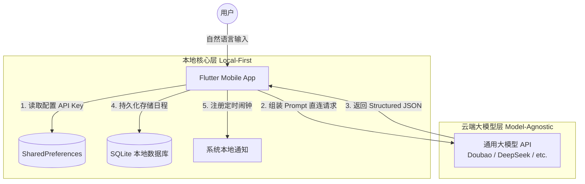

# 🚀 SyncFlow AI

> **基于大模型意图解析的高效个人调度系统中枢**

SyncFlow AI 是一款基于 LLM 的智能任务管理工具，通过自然语言处理技术，将复杂的日程录入转化为简单的“一句话指令”，大幅提升个人时间管理效率。

---

## ✨ 产品特性

- **意图驱动交互**：利用大模型自动解析自然语言（语音/文本），实现标题、时间、地点的精准提取与结构化录入。
- **极致交互效率**：通过简化操作链路，将原本需要多次点击和滚动的录入过程坍缩为秒级指令执行。
- **鲁棒防呆设计**：系统内置时间锚定与自动补全机制，即便输入信息模糊，也能通过上下文推导出准确日程。
- **运筹调度预研**：后端预留优化接口，支持接入混合整数规划算法，实现碎片化时间段的智能化填充。

---

## 📊 系统效能分析报告

项目从交互效率维度进行了量化评估，点击下方链接查看详细报告：

👉 [**点击查看：效能与人因分析报告**](./docs/System_Efficiency_Report.md)

---

## 🏗️ 系统架构



---

## 🛠️ 技术栈

- **Frontend**：Flutter (Dart) - 高性能、多端适配的响应式 UI。
- **Backend**：Python / FastAPI - 支持高并发的异步逻辑控制面。
- **AI Engine**：doubao API - 负责意图识别与实体提取。
- **Database**：SQLite - 轻量化的本地日程存储方案。

---

## 🚀 快速启动

### 后端部署

```bash
cd syncflow_backend
pip install -r requirements.txt
uvicorn main:app --reload
```

### 前端运行

```bash
cd syncflow_app
flutter run
```

---

## 📅 更新日志 (Roadmap)

- [x] v0.1: 核心意图解析引擎与 FastAPI 后端构建。
- [x] v0.2: Flutter 移动端基础交互与 Material 3 主题适配。
- [ ] v0.3: 引入运筹优化算法，实现自动化日程排列。

---

## 👤 Author

- **Author**：许哲（wwx）
- **Field**：智能效能工具开发 / 系统优化分析
