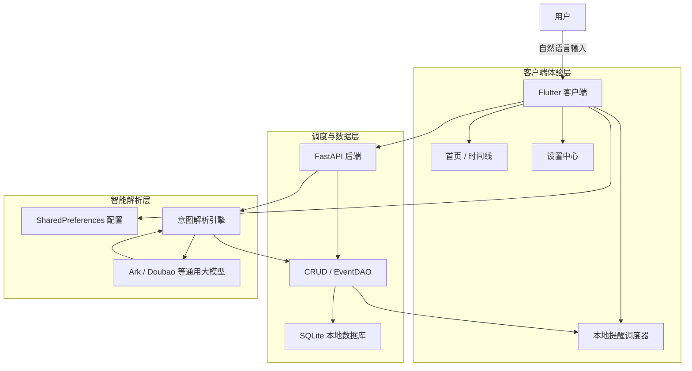
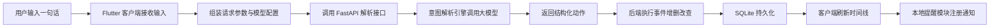
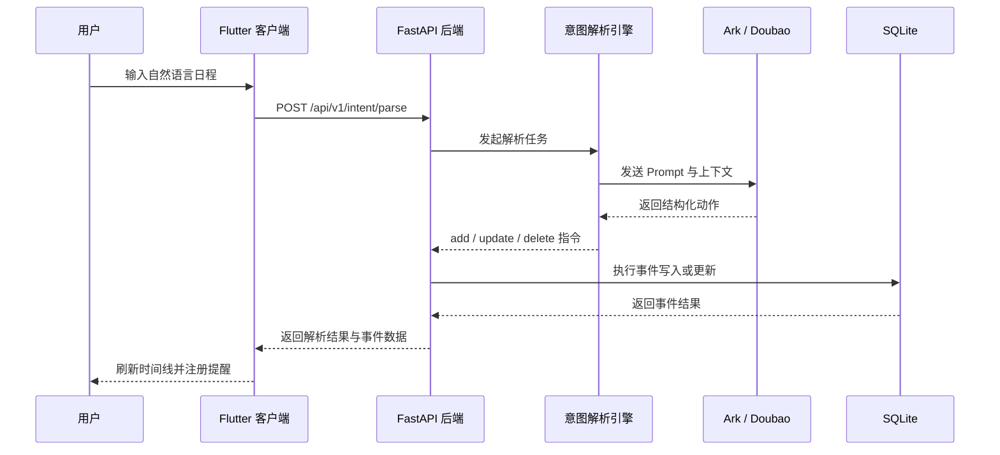

# 🚀 SyncFlow AI

<p align="center">
  
</p>

<p align="center">
  <strong>基于大模型意图解析的高效个人调度系统中枢</strong>
</p>

<p align="center">
  一句话录入日程，让任务理解、时间编排、提醒触达尽可能在同一条链路里完成。
</p>

<p align="center">
  
  
  
  
  
</p>

<p align="center">
  <a href="#product-features">产品特性</a> ·
  <a href="#feature-highlights">功能亮点</a> ·
  <a href="#screenshots">界面预览</a> ·
  <a href="#architecture">系统架构</a> ·
  <a href="#quick-start">快速启动</a> ·
  <a href="#roadmap">Roadmap</a>
</p>

SyncFlow AI 是一款基于 LLM 的智能任务管理工具，通过自然语言处理技术，将复杂的日程录入转化为简单的“一句话指令”，大幅提升个人时间管理效率。

它希望解决的不是“再做一个待办清单”，而是尽可能压缩用户从“想到一件事”到“它被准确写进时间表”之间的摩擦。

---

<a id="product-features"></a>

## ✨ 产品特性

- **意图驱动交互**：利用大模型自动解析自然语言（语音/文本），实现标题、时间、地点的精准提取与结构化录入。
- **极致交互效率**：通过简化操作链路，将原本需要多次点击和滚动的录入过程坍缩为秒级指令执行。
- **鲁棒防呆设计**：系统内置时间锚定与自动补全机制，即便输入信息模糊，也能通过上下文推导出准确日程。
- **提醒闭环能力**：Flutter 客户端已集成本地提醒能力，形成“输入 - 落库 - 唤醒”的闭环体验。
- **运筹调度预研**：后端预留优化接口，支持接入混合整数规划算法，实现碎片化时间段的智能化填充。

---

<a id="feature-highlights"></a>

## 🪄 功能亮点

| 模块 | 能力亮点 | 价值 |
| --- | --- | --- |
| 🧠 智能解析 | 一句话识别标题、时间、时长与操作意图 | 降低录入成本 |
| 📅 日程管理 | 支持新增、更新、删除、按天/按周查询 | 保持结构化日程流转 |
| 🔔 本地提醒 | 结合本地通知进行事件唤醒 | 避免“记下了但忘了看” |
| ⚙️ 模型配置 | 支持 API Key、Base URL、模型名自定义 | 兼容不同大模型供应商 |
| 💾 轻量存储 | SQLite 本地落库，启动与部署成本低 | 更适合 MVP 与个人场景 |

---

<a id="screenshots"></a>

## 🖼️ 界面预览

> 把对应截图放到 `assets/screenshots/` 目录后，这里会直接显示。若图片尚未准备好，也可以先保留占位图。

<table>
  <tr>
    <td width="50%" valign="top">
      <h3>🏠 首页总览</h3>
      <p>展示今日任务、时间分布与核心操作入口。</p>
      
    </td>
    <td width="50%" valign="top">
      <h3>🕒 时间线视图</h3>
      <p>按时间顺序呈现事件编排，强化日程感知。</p>
      
    </td>
  </tr>
  <tr>
    <td width="50%" valign="top">
      <h3>⚙️ 设置中心</h3>
      <p>配置 API Key、模型参数与默认行为。</p>
      
    </td>
    <td width="50%" valign="top">
      <h3>🎙️ 自然语言输入区</h3>
      <p>通过一句话完成任务录入与调度触发。</p>
      
    </td>
  </tr>
</table>

建议截图命名：

- `assets/screenshots/home.png`
- `assets/screenshots/timeline.png`
- `assets/screenshots/settings.png`
- `assets/screenshots/input.png`

---

## 📊 系统效能分析报告

项目从交互效率维度进行了量化评估，点击下方链接查看详细报告：

👉 [**点击查看：效能与人因分析报告**](./docs/System_Efficiency_Report.md)

---

<a id="architecture"></a>

## 🏗️ 系统架构

### 架构总览（文本版）

```text
┌──────────────────────────────────────────────┐
│                 用户输入层                   │
│         自然语言 / 文本指令 / 任务表达        │
└──────────────────────────────────────────────┘
                      │
                      ▼
┌──────────────────────────────────────────────┐
│              Flutter 客户端展示层             │
│   首页面板 / 时间线 / 设置页 / 输入交互区      │
└──────────────────────────────────────────────┘
          │                     │
          │                     ├───────────────┐
          ▼                     ▼               ▼
┌──────────────────┐  ┌──────────────────┐  ┌──────────────────┐
│ SharedPreferences│  │ 本地提醒调度模块 │  │  本地时间线展示   │
│ 模型配置/用户设置 │  │ Notification     │  │  UI State         │
└──────────────────┘  └──────────────────┘  └──────────────────┘
          │
          ▼
┌──────────────────────────────────────────────┐
│               FastAPI 后端服务层              │
│   接口路由 / 意图解析请求 / 事件增删改查       │
└──────────────────────────────────────────────┘
          │                     │
          ▼                     ▼
┌──────────────────┐  ┌────────────────────────┐
│  意图解析引擎     │  │   EventDAO / CRUD      │
│  Parser Logic    │  │   数据访问与业务规则    │
└──────────────────┘  └────────────────────────┘
          │                     │
          ▼                     ▼
┌──────────────────┐  ┌────────────────────────┐
│ Ark / Doubao LLM │  │      SQLite 数据库      │
│ 自然语言结构化    │  │   事件持久化与查询      │
└──────────────────┘  └────────────────────────┘
```

### 架构流程图（GitHub 可渲染）



### 架构说明

- **Flutter 客户端**：负责输入体验、时间线展示、提醒调度与模型配置。
- **FastAPI 后端**：负责统一接口、事件读写以及自然语言解析流程编排。
- **意图解析引擎**：负责将自然语言转换为结构化动作，例如新增、修改、删除事件。
- **SQLite**：承担轻量持久化存储，适合当前 MVP 阶段快速迭代。
- **本地提醒系统**：保证日程不仅能被记录，还能在正确时间触达用户。

---

## 🔄 使用流程图



## ⏱️ 核心 API 时序图



---

## 🛠️ 技术栈

- **Frontend**：Flutter (Dart) - 高性能、多端适配的响应式 UI。
- **Backend**：Python / FastAPI - 支持高并发的异步逻辑控制面。
- **AI Engine**：Volcengine Ark / Doubao - 负责意图识别与实体提取。
- **Database**：SQLite - 轻量化的本地日程存储方案。
- **Local Storage**：SharedPreferences - 保存用户模型配置与本地设置。

---

## 📁 项目结构

```text
.
├─ syncflow_backend/     FastAPI 后端、意图解析、事件持久化
├─ syncflow_flutter/     Flutter 客户端、时间线、设置、本地提醒
├─ docs/                 项目说明与效能分析文档
├─ syncflow.svg          项目标识
└─ test_syncflow.py      本地测试脚本
```

---

<a id="quick-start"></a>

## 🚀 快速启动

### 后端部署

```bash
cd syncflow_backend
pip install -r requirements.txt
uvicorn main:app --reload
```

`.env` 可参考：

```env
ARK_API_KEY=your_volcengine_ark_api_key
ARK_BASE_URL=https://ark.cn-beijing.volces.com/api/v3
ARK_MODEL_NAME=doubao-1-5-pro-32k-250115
DATABASE_URL=sqlite:///./syncflow.db
DEFAULT_USER_ID=default_user
SYNCFLOW_MOCK_LLM=false
```

### 前端运行

```bash
cd syncflow_flutter
flutter pub get
flutter run
```

---

## 🔌 核心接口

- `POST /api/v1/intent/parse`：解析用户输入并执行事件变更
- `GET /api/v1/events`：按 `today`、`week` 或自定义时间范围查询事件
- `PATCH /api/v1/events/{event_id}`：更新单个事件
- `DELETE /api/v1/events/{event_id}`：删除单个事件
- `GET /api/v1/runtime/status`：查看当前运行状态

---

<a id="roadmap"></a>

## 📅 更新日志 (Roadmap)

- **v0.1: Local-First 架构确立与核心链路闭环**
  - 完成 Flutter 前端、后端服务与 SQLite 落库的基础打通。
  - 建立自然语言录入到结构化事件的基本处理流程。
  - 明确“纯文本高能效输入”的交互设计方向。

- **v1.0.0: MVP 发布版本 (Current)**
  - 客户端已具备首页、时间线、设置与提醒能力。
  - 后端已支持事件增删改查与意图解析接口。
  - 支持 Ark / Doubao 兼容的大模型接入方式。

- **v1.x: 下一阶段迭代**
  - 引入更稳定的模糊语义检索与时间推断能力。
  - 优化冲突检测、连续事件编排与时间段推荐。
  - 增加更完整的自动化测试和发布流程。

---

## 👤 Author

- **Author**：许哲（wwx）
- **Field**：智能效能工具开发 / 系统优化分析
