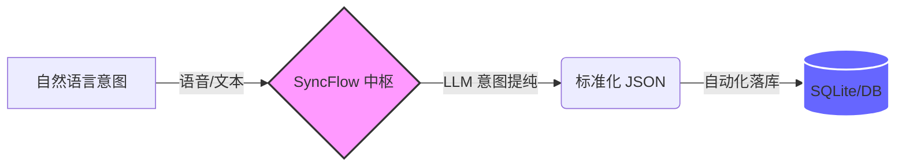

# 📊 效能与人因分析报告 (System Efficiency & Ergonomics Report)

> **项目名称**：SyncFlow AI - 基于大模型意图解析的个人效能调度系统中枢  
> **核心方向**：人机交互 (HCI) / 认知负荷控制 / 运筹优化预研

---

## 1. 痛点建模：传统 GUI 调度的“认知摩擦”

在现代高并发的任务流中，传统图形用户界面 (GUI) 强迫用户充当“人脑编译器”，产生了巨大的外在认知负荷。

### 1.1 KLM-GOMS 微动作量化分析

| 动作代码 | 动作定义 | 标准耗时 (s) |
| :--- | :--- | :--- |
| **M** | **Mental** (心理准备/认知转换) | 1.20 |
| **K** | **Keystroke** (点击/敲击) | 0.20 |
| **P** | **Pointing** (滑动/寻找目标) | 1.10 |

- **传统日历执行流 (理想态)**： $T_{GUI} = 7.3s$
- **SyncFlow AI 执行流 (语音/文本)**： $T_{NLP} = 4.6s$

> **📈 结论**：物理交互步骤缩减 **87.5%**，绝对耗时缩减约 **37%**。

---

## 2. 核心架构：将 NLP 作为终极 UI

## 3. 工业工程防呆设计 (Poka-Yoke)

为了确保系统在复杂环境下依然具备极高的鲁棒性，本系统引入了三层防呆机制：

- **时间锚定 (Time Anchoring)**：注入 `[Current_Time]` 环境变量，将“明天”、“下周”等模糊意图精准映射为绝对时间戳。
- **智能填充 (Auto-fill)**：大模型自动补全缺省值（如默认会议时长），减少用户的冗余表达。
- **容错处理 (Error Recovery)**：采用软删除 (Soft-Delete) 逻辑，确保 100% 的误操作可恢复性。

## 4. 演进蓝图：运筹优化模型 (Operations Research)

作为工业工程方向的预研，本系统未来计划引入混合整数规划 (MIP) 算法，解决碎片化时间的“装箱”优化问题。

**目标函数 (Objective):**

$$
\max \sum_{i} x_i \cdot C_i
$$

**约束条件 (Constraints):**

$$
s\text{.}t\text{.} \quad \text{Deadline}_i \le T_{end}
$$

$$
s\text{.}t\text{.} \quad \text{Overlap}(Event_A, Event_B) = 0
$$
